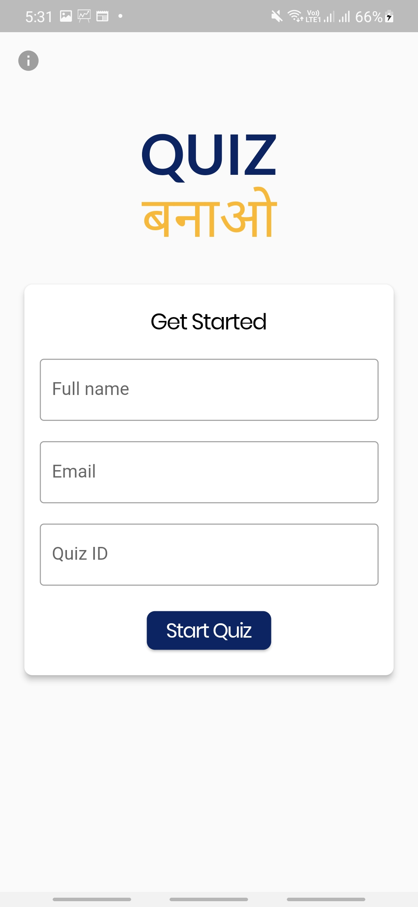
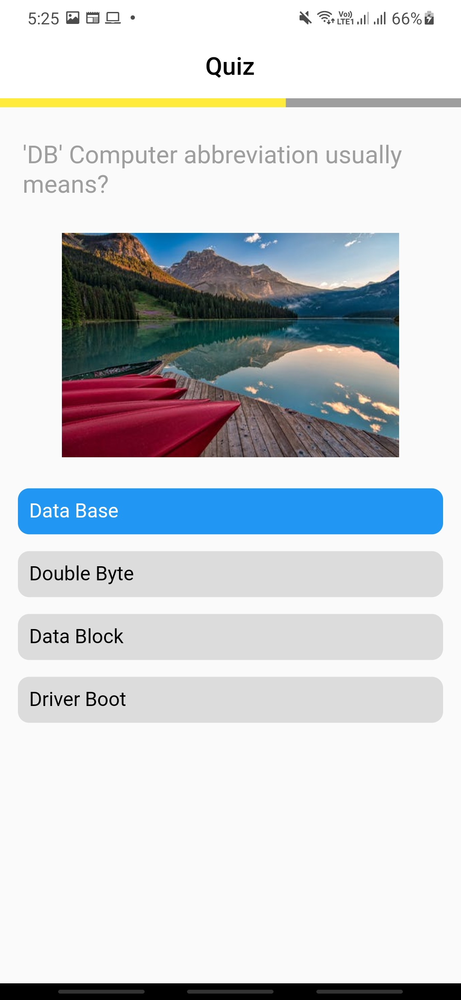
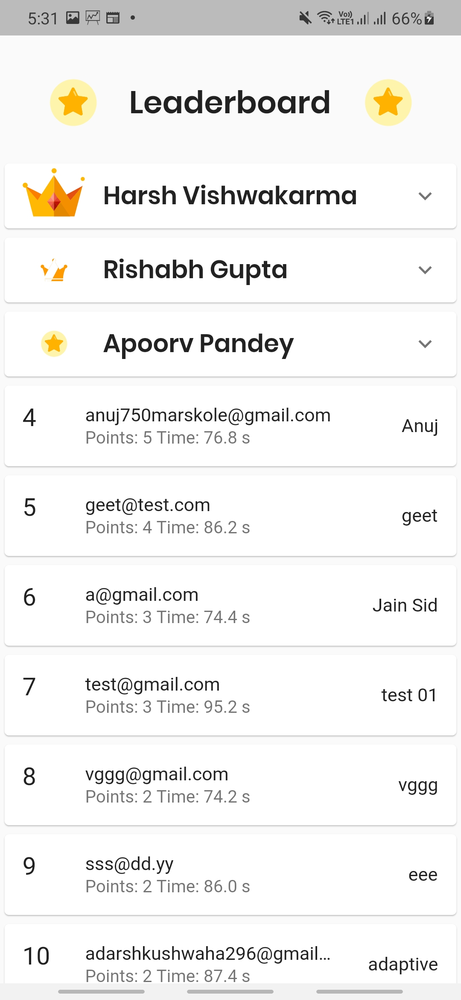

# QuizBanao 

 uizBanao is an open sourced app that allows you to host quizzes for Webinars and Live events!

It can also be used for other types of quizzes.
   

This Flutter project supports Android and Web out of the box.

## Devs 
[Apoorv Pandey](https://github.com/apoorvpandey0), [Ankur Gupta](https://github.com/ankurg132)

## Links
[Play store link](https://play.google.com/console/u/0/developers/6195582735877306679/app/4976094919562156145/app-dashboard?timespan=thirtyDays )

[Web version](https://web.quizbanao.com/)

[Landing page](https://quizbanao.com/)